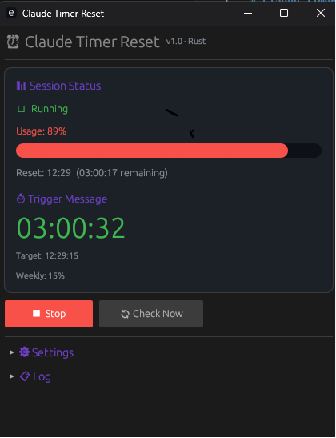

# Claude Timer Reset ⏰

An autonomous, lightweight (5MB), native Windows desktop application to track Claude CLI session usage and automatically restart your session when it resets.



## Why Rust?
- **Ultra-lightweight:** Consumes only ~10-15MB RAM (10x lighter than typical Electron applications).
- **Zero Installation:** Provided as a single standalone `.exe` binary. No Python, Node.js, or dependencies required to run.
- **Native Look & Feel:** Sleek, modern dark-theme interface powered by Rust's `egui` framework.

## Features
- 📊 **Autonomous Tracking:** Runs `claude -p "/usage"` in the background to automatically parse your current usage percentage and session reset time (e.g. `resets Jul 11, 12:30pm`).
- ⏱ **Auto-Timer:** Automatically schedules a countdown timer targeting the exact second of the reset (plus a configurable safety cooldown, e.g. +60 seconds).
- 🤖 **Auto-Start:** When the countdown timer expires, it sends a lightweight prompt (`this is a test message`) using the Haiku model to otonomously establish and initialize a fresh 5-hour session.
- 🕒 **Periodic Refresh:** Checks status at configurable intervals (e.g. every 60 minutes) to keep timers accurate.
- 💾 **Collapsible Widgets:** Compact, minimalist interface with collapsible Settings and Logs.
- 🔒 **Single Instance Mutex:** Prevents duplicate app instances from running simultaneously.
- 💻 **No Console Window:** Hidden background subsystem. Zero CMD console flashing or lingering terminal windows.

## Getting Started

1. Download [claude-timer-reset.exe](claude-timer-reset.exe).
2. Configure settings:
   - **Model:** `haiku` (recommended for minimal limit usage), `sonnet`, or `opus`.
   - **Message:** The message to trigger the fresh session (default: `this is a test message`).
   - **Claude Path:** Automatically detected on standard Windows npm setups. If custom, provide the absolute path.
   - **Check Interval:** Frequency in minutes to check usage (default: `60`).
   - **Wait after reset:** Cooldown in seconds to wait after reset time before triggering (at least `60` seconds recommended to allow server clocks to sync).
3. Click **`▶ Start`**. The application will enter autonomous mode, perform checks, and start the countdown.

## Building from Source

To compile the application yourself, ensure you have Rust installed and run:

```bash
cargo build --release
```

The optimized binary will be created at `target/release/claude-timer-reset.exe`.

## Requirements
- Windows 10 / 11
- Installed global Claude CLI (`npm install -g @anthropic-ai/claude-code`)

## License
MIT
